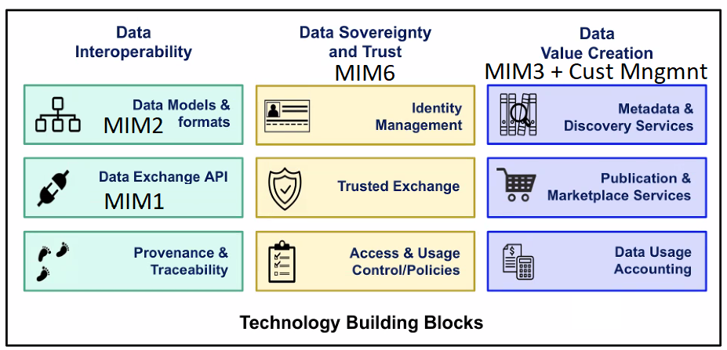

# MIM3 - Contracts

## Status

| 
💡 Work Item
 | 
🧩

Capabilities
 | 
🏗

Specification
 | 
👩⚖

Governance
 |
| :------------------------------------------------------------------------------------------: | :------------------------------------------------------------------------------------------------: | :-------------------------------------------------------------------------------------------------: | :----------------------------------------------------------------------------------------------------: |
|                                     :white\_check\_mark:                                     |                                        :white\_check\_mark:                                        |                                         :white\_check\_mark:                                        |                                                                                                        |

## Objectives

Scaling of data services, including IoT- and AI-enabled services, within cities and communities requires easy and risk-free access to suitable local data sources that are already within those communities. A local data marketplace allows for easy and risk-free access to relevant and available local data, solutions, and other resources so that new and valuable services and solutions, many of which have been already deployed in other cities can easily be implemented within the local area. The use and re-use realizes new societal values, including new revenue streams, incentivising the stakeholders, including infrastructure owners, to share data, analytics, services and/or solutions in infrastructure partnerships based on key technology enablers.

MIM3 is the management layer that allows stakeholders:

* To provide data along with relevant information about its content and quality and any terms and conditions for use.
* To provide data processing services along with relevant information and terms and conditions for using the services.
* &#x20;To find and access the data and data processing services and other services they need and to be able to gain relevant insights into what those data streams/data processing services/data applications consist of and how valuable they can be.

## Capabilities

The marketplace realises standardised exposure of data and data set offerings built on standard interoperability mechanisms (e.g., those result of combining MIM1 and MIM2) and mechanisms for guaranteeing security and privacy by design. The marketplace also realises access to services offerings that build on this data and transfer it to knowledge, intelligence, and information for the consumers.

A crucial aspect of a marketplace is ecosystem transaction management. These functionalities enable effective matchmaking of relevant data sources (e.g., urban IoT data) from providers with respective data consumers, facilitate trusted exploitation of such data based on enforceable data usage agreements and secure value flow between these stakeholders.

The marketplace needs to provide a number of capabilities which may include some or all of the following. Management of:

* **Catalogues**\
  _This module provides functionalities to publish and search for different data service 1 offerings. Data offerings can be organized into groups/categories - in a hierarchical fashion when possible - to allow for an easy navigation and discovery of them. The module allows data providers to define the technical description of the data offerings they own as well as information related to the offering terms and conditions such as price, SLA, license, etc._
* **Offers/Orders**\
  _This module allows the ordering and acquisition of "data service" `` offerings and managing acquired rights on data services. More specifically, a data consumer interested in purchasing a data service offering available in the catalogue can place an order to finalize the purchase of that digital asset. It allows the performance of operations such as subscription un-subscription, activation, deactivation, and renewal._


_With the term “data service” we include both data access and data processing services_


* **Revenue sharing**\
  ****_This module allows data providers to generate revenue for their offerings by charging data consumers for purchasing them. It provides tools to manage data service usage information in order to enable usage-based business models. It exposes an interface to interact with external charging platforms such as PayPal. It collects all the information required for the charging process (price, data service usage, consumer identifier, etc.), which may differ according to the pricing model associated with the data service offering and the outcome received by the external charging platform._
* **SLAs and data licenses**\
  ****_This module allows data service providers to set, define and customize different SLAs and licenses for data offering published on the data marketplace, thus enabling the creation of a dynamic ecosystem in which data service providers can establish various business models. It provides an interface to retrieve predefined data usage license templates so that data providers can link a data usage license instance selected among the available templates to the related data service offerings._
* **Feedback and reputation**\
  _This module provides user feedback management for the different data service offerings published on the marketplace. It also provides rating and reputation mechanisms to support data consumers in selecting the data service offerings and to promote an honest behaviour among users and providers._
* **Party Management**\
  ****_This module covers the identification and gathering of information associated to parties involved in the exchange of data through data services and which can play the role of consumers and providers of data services. Parties can be individuals or organizations playing the role of consumers and/or providers._
* **Customer**\
  _This module covers the identification and gathering of information about the users of the marketplace. It provides tools to manage customer information and related parties, which are the legal entities associated with the customer accounts. Depending on the access restrictions for the marketplace defined by the marketplace provider (e.g., city council, consortium, 3rd party), customers can be created and linked to specific roles (e.g., data provider, data consumer, administrator, etc.)_
* **Transparency and accountability service**\
  ****_This module provides tools for auditing orders (including pricing model, license terms, SLAs) and tracking the parameters defined by SLAs._
* **Federation**\
  _This module manages a set of federation capabilities in accordance with the marketplace governance. Federation capabilities allow different marketplaces to interact with each other and access their resources to provide access to data offerings across them and enable the development of aggregated services._

There are various ways to realise such Ecosystem Transaction Management. A standardised way of doing so is provided by TM Forum, who has created an API suite of specifications for digital marketplaces, named the Business API Ecosystem.

## Specifications

**Recommended specifications:**

* Basic Data Marketplace Enablers [SynchroniCity\_D2.4.pdf](https://oascities.org/wp-content/uploads/2022/08/SynchroniCity\_D2.4.pdf)
* Reference Architecture for IoT Enabled Smart Cities, Update: [SynchroniCity\_D2.10.pdf](https://oascities.org/wp-content/uploads/2022/08/SynchroniCity\_D2.10.pdf)
* TM Forum Open APIs and component suites provide service and a technology-neutral suite of APIs that provide the minimum building blocks for interoperability across all operational management areas. Each API and component suite provide the specification, reference implementations and in most cases conformance test kits. Reference Implementations are available under the Apache2.0 license. These APIs have gained global adoption in the Telecommunications industry and are proven to maximize reuse. They are designed to be extendable as required for specific services. The respective data models have been harmonised with FIWARE and GSMA data models. [https://projects.tmforum.org/wiki/display/API/Open+API+Table](https://projects.tmforum.org/wiki/display/API/Open+API+Table)

Examples of TM Forum specifications that link with the capabilities listed above:

* Catalogue management: TMF620 API, TMF633 API, TMF634 API, TMF637 API, TMF638 API, TMF639 API
* Offers/Orders management: TMF622 API, TMF641 API, TMF652 API&#x20;
* Revenue (sharing) management including Payment Methods: TMF670 API, Payment Management: TMF676 API, Shopping Cart Management: TMF633 API
* SLA and data license management&#x20;
* Feedback and reputation service
* Party Management: TMF632 API
* Customer management: TMF629 API
* Transparency and accountability service
* Federation management

An open-source implementation of these capabilities can be found in FIWARE (Business API Ecosystem framework) which was used in SynchroniCity and more recently in the [i4Trust project](https://i4trust.org/), covering data value creation building blocks for data spaces. Other examples of the implementation of these capabilities can be found in Gaia-X, IDSA data spaces, and the Indian Urban Data Xchange and the intention is to provide more detailed information about these in the next edition of MIM3.

## Tasks to further develop MIM3 over this coming work year

1. Link with the work members of the Data Space Business Alliance (BDVA, FIWARE Foundation, Gaia-X, IDSA) are carrying out related to smart cities to align and better position the MIMs as key enablers for Data Spaces and Local Digital twins. Here is an example of how the MIMs are relevant to data spaces, showing the role of MIM3.

2\. Investigate and build links with other initiatives that are implementing data spaces/data marketplaces such as the Indian Urban Data Xchange to understand any additional specifications that could be added in the next edition of MIM3.

3\. Undertake customer journeys of the key types of stakeholders in local data ecosystem or data spaces to identify the key requirements needed. Actors (not yet fully fledged Personas) in a Marketplace include:

* Government
* Private Companies
* Academia
* Civil Society
* Environment (proxy)

This work will enable us to review the existing list of capabilities to:

* See if there are any missing capabilities
* Better define the capabilities
* Prioritise the capabilities into required and recommended

4\. Undertake a deep dive on the Catalogue Management capability as an example of what is needed for all of the capabilities within MIM3 longer term. Identify what APIs and other solutions exist that can meet those requirements, identify any gaps and then work to fill those gaps with, for example new or modified APIs.

After Catalogue management the probable order to implement (and therefore describe) is:

1. Publication & Discovery services (nothing useful in the catalogue without these) + Customer management - phase 2 adds Transparency and accountability & Federation management
2. Marketplace services (or we won't have a transaction - Ordering / Offers/Orders management + description of data license & quality & SLA)
3. Data Usage & Accounting (revenue)
