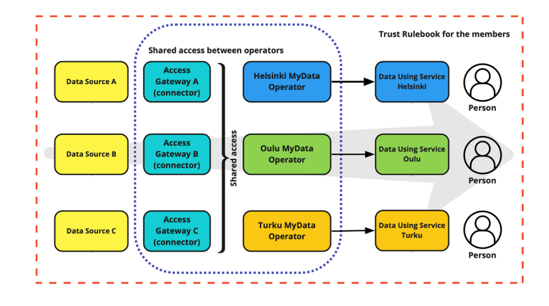

# MIM4 - Trust

## Status

| 
💡

Work Item
 | 
🧩

Capabilities
 | 
🏗

Specification
 | 
👩⚖

Governance
 |
| :---------------------------------------------------------------------------------------------: | :------------------------------------------------------------------------------------------------: | :-------------------------------------------------------------------------------------------------: | :----------------------------------------------------------------------------------------------------: |
|                                       :white\_check\_mark:                                      |                                        :white\_check\_mark:                                        |                                                                                                     |                                                                                                        |

## Background

MIM4 focuses on Personal Data Management in other words how to provide easy to use methods for citizens/users to control which data sets/attributes they want to share with solution, application, or service providers under transparent circumstances, enabling trust between the different parties.

There are many initiatives seeking to provide personal data management solutions, but these are primarily in the pilot or development phase, and this has led to a fragmented marketplace.

The aims of the different initiatives overlap but are not necessarily identical. Some projects focus just on personal data management, others, such as RUDI, aim to support wider data sharing ecosystems, but with personal data management being a key feature.

There are two networks of providers – MyData and Solid, which each follow different high-level methodologies. Even within each of these two networks, there are significant differences in the technical and processes used by different projects and so individual implementations are not necessarily interoperable.

There are a number of initiatives outside of these networks developing their own technical solutions.

The role of MIM4 is to identify the key capabilities required and identify pivotal points of interoperability between the different solutions to help build confidence and support implementation.

## Objectives

To provide technical and other guidance to support cities and communities to put in place the products and services that will enable their citizens to be in control of their personal data within the local data ecosystem.

To do this in a way that will make it easy to integrate with whatever credible personal data management systems their citizens may wish to use.

MIM4 will define:

* The capabilities that cities and communities need to put in place to enable citizens to have control of their data within the local data ecosystem;
* The requirements to enable "good enough" interoperability between existing services and projects that offer solutions for personal data management;
* Any linkages with any of the other MIMs needed to support the implementation of MIM4 into a local data ecosystem;

MIM4 will also point to sets of recommended solutions that will enable cities and communities to comply with these requirements.

## Capabilities

MIM4 will address needs and requirements from two perspectives:

* That of Individual citizens in terms of transparency & privacy preferences collection;
* Cities and Data Using Services (Data Controller/Processors/) in terms of Authorization and Data usage control and enforcement;

The provisional sets of capabilities required are listed below:

### **For individual citizens**

1.Citizens need to be able to choose the operator they wish to manage their data and to move from operator to operator.

2\. Citizens should be able to access their data through many different channels.

3\. Citizens should be able to use the identity of their choosing, in best cases a keychain of identities can be defined, so that users can choose the identity per service.

4\. Citizens should have insight what personal data is available, stored, shared, etc. by the providers of the applications and/or services they use.

5\. Citizens should be able to request changes to or deletion of part or all personal data available, stored, shared, etc. by the provider of the applications and/or services in use. The providers would need to comply with these requests unless there were legally justifiable reasons not to do so.


For instance, the citizen cannot expect information regarding their age or any other key factual piece of information to be changed so as to be incorrect, specifically in a way that will affect their eligibility for services.


6\. Citizens should be able to indicate in which circumstances what personal data is ‘free’ to use for which parties through a 'permission arrangement'.

7\. Citizens should be able to grant consent to providers of the applications and/or services, be it governmental or businesses, that attribute based, decentralised storage and ‘revealing’ of personal data attributes provides full service and access to these applications and/or services.

8\. Citizens should be able to roam with their data between cities and internationally.

### **For cities and data using services**

9\. Cities need to enable users to handle consent, allow and revoke access, and have full transparency on their personal data.

10\. Permission management needs to be handled preferably on the attribute level. Personal data processing should be described in a fine-grained manner, by covering all aspects (purposes, processing, types of data …) in a standardized manner.


See as example W3C dpv: [https://dpvcg.github.io/dpv/](https://dpvcg.github.io/dpv/)


11\. Personal Data Management needs to have an open API in line with MIM1 to broker data and standard data models MIM2. Data sources need to be open and documented, and discoverable via MIM1, listing their data via MIM2. Operators may benefit from being groupable at joint initiative of cities with close ties.

12\. PDM systems need to manage the personal data to a high level of security.


The detail of how to do this will be dealt with by MIM6.


13\. PDM systems need to be flexible enough to handle methodologies that require personal data pods to store the data as well as those that utilise personal data spaces or that allow the data to continue to be stored by the relevant organisation, but where the subject of the data is able to exercise rights as to its use.

## Requirements

A detailed proposal for interoperability between Personal Data Management Operators was proposed to OASC in May 2021. This proposal has two pillars:

Pillar 1: **One Connector for all Personal Data Management Operators**.

&#x20;Pillar 2: **Legal framework governance**

The proposal is described in the paper “_Towards Interoperable Personal Data Management within Smart Cities: Minimum Interoperability Mechanism 4_” that can be accessed at: [References](references.md)

Effectively, this defines a connector that enables any Personal Data Management provider that complies with the Legal agreement to be able to access data from any data source that is MIM4 compliant. In this way, each Personal Data Management provider can innovate freely around their technical solution, provided that it enables the capabilities defined in MIM4 while data providers only need to provide a single method for them to access the data.

<figure><figcaption></figcaption></figure>

While designed for the MyData network, the MIM4 proposal has now been reviewed in detail by MyData Global, Vastuu Group, Forum Virium Helsinki, RUDI (the Urban Data Initiative of the city of Rennes), the DataVaults and Kraken European Projects focusing on Personal Data Management and the CAPE personal data management solution developed by Engineering.

This review indicated that the proposed interoperability mechanism is a feasible way of enabling a level of interoperability between all of these and is likely to be relevant to all Personal Data Management solutions. All of the above initiatives have also agreed to work together over the next few months to develop demos to test the proposed MIM4 Part 1 in practice.

## MIM4 Working Group members

Representatives of the following organisations:

* Cities of Athens, Eindhoven, Poznan, Vienna.
* European Commission: DG Connect and DG Digit.
* Companies: ATOS, Engineering, NEC, Vastuu Group.

## Recommendations approved at the OASC Annual Summit on June 7th 2022:

* To approve the proposed MIM4 technical specifications.
* To agree the development of the legal framework should be completed to bring to the Annual Summit in 2023 for agreement.
* To agree that a programme of testing and review by cities should be set up by OASC for the coming year to report back to the Annual Summit in 2023.
