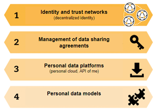

# OASC MIM4: City of Helsinki proposal

Corresponding author:

* Kimmo Karhu, City of Helsinki \(k[immo.karhu@hel.fi\)](mailto:kimmo.karhu@hel.fi)

Other contributors:

* Mika Leivo, City of Helsinki
* Mikko Rusama, City of Helsinki
* Antti Poikola, MyData Global

Note! To get things going, this is just a direct copy-paste of our white paper that we presented at OASC conference in Jan 2020.

## Background—why City of Helsinki is interested in this? 

Helsinki wants to be the most functional city in the world by making full use of its data. Tomorrow’s Helsinki will be able to predict and provide services in a proactive, not just reactive manner.

To realize the vision, one key component in the data strategy is the Helsinki profile, a shared customer profile across all citizen services based on [MyData](https://mydata.org/) principles\[1\], i.e., people decide on how they data is used. In the Helsinki profile, the customer is understood broadly including residents, workers, tourists, and students. For example: How could a student living at city of Turku give consent to use her student status when using public transportation at Helsinki?

## Motivation—enable citizens to roam between cities 

Sharing and reuse of personal data is increasingly important for cities in providing digital services to their citizens. Due to developments in AI and machine learning, there is an ongoing paradigm shift from reactive to proactive city, i.e., serving citizens in a more personalized way. Furthermore, as Facebook and Cambridge Analytica scandal illustrated, there is an urgent need for citizens to be in control of their own data.

There is no point in all cities doing overlapping work in this area. Furthermore, since citizens commute across cities, both nationally and globally, it would be beneficial to have common standards for personal data exchange, i.e., kind of “citizen roaming”.

Many of these features are required by the law. For example, GDPR requires that the consent is always given for a specific purpose. On the other hand, if two laws are applicable for same data \(e.g., privacy and health care legislation\) which one rules? Specific consent could help to solve these conflicts.

We believe OASC provides a forum through which we can build common European standards for citizen profile and data exchange. This will hopefully also open up opportunities to do research and other collaboration with other European cities.

## Scope—minimum set of requirements 

We believe that MyData principles provide a recognized and solid ground for advancing minimal interoperability mechanisms \(MIMs\) for personal data management. MyData stack\[2\] \(see Figure 1\) contains the necessary technical building blocks for implementing personal data management. A critical layer is the management of data sharing agreements \(layer 2\). In addition to specific user consent, along the GDPR regulation\[3\], it should support processing based on contract, legal obligation, interests of the data subject, public interest, and other legitimate reasons.

This stack is realized by MyData operators that a person can then use to control which service providers can have access to his/her data and for what purpose. In practice, there will be several MyData operators. For example, considering the city context, each city could operate as a MyData operator.

To make the first steps, we need to identify a minimum common set of requirements. From the practical and city perspective, we need:

* **Layer 1:** A citizen profile or account to which we can attach personal digital identities, data preferences and data sharing agreements
* **Layer 2:** A way to define data sharing agreements that define data, purpose, and lawful base for processing. While GDPR lists the six reasons, we think, that being able to manage a specific user consent is a good starting point
* **Layer 3:** The standard should only define the APIs \(e.g., for Layers 1 and 2\) and each MyData operator, such as Helsinki, could then integrate their own backends and/or purchase compatible operator capability as a service as they see best
* **Layer 4:** A shared data model OR a way to map distinct models to each other

To allow citizen to truly “roam” between cities / MyData operators, few other capabilities are needed:

* **Import/export:** To transfer all historical data from one operator to another
* **Delete:** Citizen should be able to delete all their consent based data
* **Archive:** Legislation may require that some data is archived and cannot be deleted

Ethical considerations are important and there should be some minimum requirements for participating entities.

## How—what we are doing in the near future? 

We are currently taking the Helsinki profile in use. Our starting point is that citizens can give consent for a specific purpose. We are piloting few services and also working jointly with other cities in Finland. We also have initiated few funding proposals in the area. Our plan is to have one service utilizing Helsinki profile in full operation before the summer.  
  

\[1\] see [https://mydata.org/declaration/](https://mydata.org/declaration/)

\[2\] adapted from [http://julkaisut.valtioneuvosto.fi/bitstream/handle/10024/160954/MyData 2018.pdf](http://julkaisut.valtioneuvosto.fi/bitstream/handle/10024/160954/MyData%202018.pdf)

\[3\] see article 6 at [https://eur-lex.europa.eu/eli/reg/2016/679/oj](https://eur-lex.europa.eu/eli/reg/2016/679/oj)

