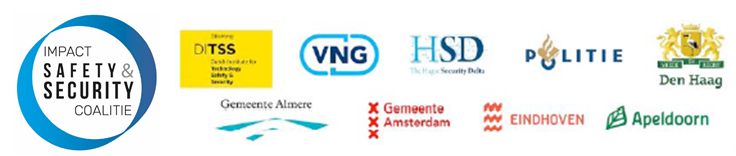
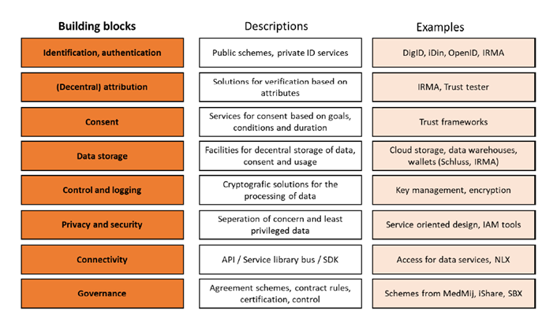

# OASC MIMs : Dutch Public Trust Infrastructure

## **ALSO VERY DRAFTY - WORK IN PROGRESS** 

This is not much more than a copy-paste excercise form various douments harvested and collated by Rick Schager, Municipality of Eindhoven \([r.schager@eindhoven.nl](mailto:r.schager@eindhoven.nl)\)  
The sources are indicated below \(each\) Chapter.

### Background: Why are the Dutch and Eindhoven that interested? 

It has become clear that digitization, next to its great opportunities, also entails risks for public values, such as autonomy, non-discrimination and privacy. Personal data play an important role in this. We also see that the increasingly accessible availability of personal data facilitates identity theft and other forms of cybercrime. In essence, there are currently 3 problems related to personal data:

1.  Control over your personal data;
2.  Availability of data for social goals;
3. Data exchange is costly and inefficient.

A Dutch Public Trust Infrastructure gives people and organizations control over the use of their data, the certainty that data is used according to the given consent and it allows for reasonable compensation for data sharing. On the other hand digital service providers, government and research among others, get cheaper and easier access to data that are more reliable and explicitly authorized. \[5\]

#### Dutch Digital Government Agenda & Strategy 

_Attention to public values_ is 1 of the 5 main principles of the Dutch Digital Government Agenda \[1\]:  
”Governments, businesses, citizens and knowledge institutions work together in Smart Society integrated and data-driven solutions to improve the quality of life and the competitiveness of cities. In this context, a method is developed that support and speeds up the development and scaling up of innovative digital solutions. This is done in 'Impact Coalitions', such as for '_Safety & Security_' and 'Digitization of the Outdoor Space'. More and more municipalities are fitting new technologies in the public domain. There are principles for a digital city drawn up. These principles include the protection of public values in digitization. In addition, the practice guideline 'Open Urban Platforms' \[2\] developed at the NEN, which is used among others by municipalities in tendering platforms to collect data on cities and exchange.”

From the Dutch Digitization Strategy \[3\], theme _Groundbreaking research and innovation_, at the ambitions and action plans for _Blockchain_ and _Cybersecurity:_ “The Ministry of Internal Affairs \(BZK\) and the Association of Dutch Municipalities \(VNG\) are working with municipalities on Ecosystem Smart Society, for acceleration and scaling up specific icon trajectories, such as safety and security and digitization of outdoor areas. Smart Society Icon projects are supported in attracting partners, designing PPPs and filling in financing questions. Specific attention is paid to the \(national\) coordination of research and product development within ethical and legal framework”.

#### Impact Coalition Safety & Security 

This Smart Society Ecosystem, the Impact Coalition Safety & Security, ambition is to “increase urban safety through the responsible and more effective use of new technology and data so that citizens, businesses, municipalities and the police can continue to work together \(also in the future\) to create a safe Dutch society”.

In the Impact Coalition Safety & Security the partners \(the Association of Dutch Municipalities \(VNG\); the \(national\) Police, the Dutch Institute for Technology, Safety and Security; the The Hague Security Delta and several large\(r\) municipalities\) work together by:

* cleverly using each other's experimental space;
* focus cooperation on innovation and scaling up;
* actively sharing of knowledge and experience;
* joint international profiling and programming.

The \(public\) Digital Trust Infrastructure is one of the icon projects of the Impact Coalition Safety & Security.

\[1\] [https://www.digitaleoverheid.nl/wp-content/uploads/sites/8/2020/07/nl-digibeter-2020.pdf](https://www.digitaleoverheid.nl/wp-content/uploads/sites/8/2020/07/nl-digibeter-2020.pdf) \(in Dutch\)

\[2\] [https://www.nen.nl/npr-8284-2020-en-270238](https://www.nen.nl/npr-8284-2020-en-270238)

\[3\] [https://www.rijksoverheid.nl/binaries/rijksoverheid/documenten/rapporten/2020/06/25/nederlandse-digitaliseringsstrategie-2020/Nederlandse+Digitaliseringsstrategie+2020.pdf](https://www.rijksoverheid.nl/binaries/rijksoverheid/documenten/rapporten/2020/06/25/nederlandse-digitaliseringsstrategie-2020/Nederlandse+Digitaliseringsstrategie+2020.pdf) \(in Dutch\)

## A public trust infrastructure for personal data \[4\] 

### Why a Public Digital Trust Infrastructure? 

Trust is based on safeguards. An online trust framework provides the digital safeguards needed to start a relationship or to execute a transaction. Like safeguards for identity information, authentication data and related access and management resources. It’s called a trust framework when such safeguards are recognized by different parties. In essence a Trust Framework organises:

1. the access to your data and your devices as to **allow you to share those with others under your conditions**
2.  conditional access to data and devices of governments, organisations and civilians, **so that you can realize innovative, joint value adding services**

A generic facility provides conditions and benefits to operate in the digital domain. For _businesses and public organisations_, it brings the following benefits:

* Access to verified identities
* Verified consent for use of data
* Access to personal data for which consent is complex or impossible to obtain
* More reliable data
* An easy and cheaper way to comply with laws and regulations for the use of personal data
* An attractive channel to provide data services
* Possibility of cross-sectoral collaboration with other providers of data services

The government also has an interest in the existence of trust infrastructure _from a constitutional perspective:_

* Citizens are in control of their own data
* The safety of personal data is better ensured
* Citizens’ privacy is better protected
* No monopoly for data exchange with private parties
* Reliable provision for digital communication between public administrations and citizens
* The existence of a public facility for reliable digital information
* A prerequisite for a flourishing digital economy.
* Contributes to safety and quality of life in a digitalized society.

For _citizens_, trust infrastructure for data services can provide:

* Control of the use of the digital identity and of personal data
* Only those data that are minimum necessary for the intended purpose
* Economic advantage of being able to offer personal data in return for remuneration
* Secure and trusted exchange of digital information
* Attractive data services and tools for access, use and management of digital information, such as moving personal data from one platform to another
* Opportunity for local information exchange
* Data from different devices with sensors\(objects\), which are now available to suppliers, can also be made available to the owners.

People are or will become owners of their own personal data. This gives them the opportunity to use and share them at their own discretion, based on their own decisions and own conditions. Data exchange under the direction of the owner not only avoids the problems with personal data controlled by organisations, but will also ensure much richer and more reliable data. Richer because individuals can combine information from different sources and life areas more easily. More reliable, as owners themselves are the source of their information instead of it being derived from different sources. First-hand personal data are not only more reliable, but with a clear permission from and arrangement with the owner, also better available to organizations. The trust infrastructure as a generic provision makes the exchange of data simpler, more transparent and cheaper. This can be illustrated as follows:

Thus, the main principle for a public trust infrastructure is that only the owner of data or objects authorizes the use of data for agreed purposes. It is therefore important that there are safeguards to check the owner and his or her characteristics.  
To do this, the trust infrastructure includes all the core components \(building blocks\) of trust such as identification, authentication, registration, attribution, consent and mandate, management, decentralized identity solutions, storage and security.

### Principles for a trust infrastructure 

In order to trust a digital trust infrastructure for both the public and private domains, it is important to be transparent about the principles that are. These principles are, as far as possible, enforced on the parties using the trust infrastructure as a provision for data sharing.

1. Fairness & transparency Data are obtained and used in a fair and legal way. This means that at least one of the following conditions is met when obtaining data:
   1. Data subjects \(each person the personal data \(may\) refer\(s\) to\) have explicitly authorized the acquisition and processing of the data for the purposes agreed upon. Consent shall be obtained in a way that is understandable by the data subjects. Consent granted to obtain data can be withdrawn at a later stage.
   2. The acquisition and processing of the data is necessary for the performance of a legal task by the data processor. Minors and vulnerable persons shall be sufficiently protected in the process of obtaining data.
2. Data minimisation principle Only those data are collected and processed which are necessary for the fulfilment of the purpose for which the consent has been given or which are necessary for the performance of a statutory task.
3. ‘purpose limitation’ principle The data obtained shall be used only for the purpose for which consent has been given or subject to a legal authorisation. Data shall not be made available to other processors unless permitted by a separate authorisation or legal basis.
4. Accurate and up to date data Personal data should be accurate and kept up-to-date where necessary.
5.  Data retention limit Personal data shall be kept no longer than necessary for the purpose for which it was obtained
6.  Integrity and confidentiality All appropriate technical and organisational measures shall be taken to ensure the security and confidentiality of data and data traffic.
7. Lawfulness Data is stored under EU & NL laws and regulations.
8. Access and correction Data subjects must always have access to their data and have the opportunity to check them for accuracy and, where necessary, to change them.
9. Transparency and control of use Data subjects shall be able to verify the actual use of their data, the purposes for which they are used and any security incidents.
10. User friendliness For all actions that data subjects have to or wish to implement in relation to the use of their data, a user-friendly environment must be available.
11. Portability Data subjects shall be able to remove their personal data from a data processor and take them to another party unless the data processor is a legally designated party.

The following principles apply specifically for the development of the public trust infrastructure:

* Open source: The source code of the infrastructure shall be available under Open Source license. Services developed by organisations have discretion to add components to the open source Library \(meta-services\) or operate it as a service under its own management. At a later stage where, through the generic facility, commercial services may also be offered, an operation must be carried out.
* Privacy by design: Parties shall use privacy by design as much as possible in the design of their services
* Least Privileged data: users providing services through the generic provision shall not request more data than is necessary for the service
* Decentralised approvals architecture: The infrastructure is designed with decentralised facilities in mind. The data/object owner and the permissions he/she has to manage, is central to this concept.

### Building blocks for a generic trust infrastructure 

The availability of a generic trust infrastructure doesn’t have to be a technical challenge, the functionality has in fact already been realized and tested in practice. By combining a number of existing building blocks, in particular the consent arrangement solution developed by Alliander and the attribute based IRMA, in a single coherent provision, the necessary functionality will be available. The main elements of these building blocks are:

* **Identification**: Identification defines the identity of the subject \(person, organisation\) and subject. Identification mechanisms can contribute to increased certainty over the identity of legal entities, natural persons and/or objects. Specific features of an identity can be added as an attribute to an identity, as to allow for the separate confirmation of these specific identity characteristics individually.
* **Attribution**:  IRMA \(I reveal My Attributes\) is an application in which validation of various public and private identification schemes can be stored decentrally as an attribute at the user/owner. The user may then issue attributes him/herself as to proof his specific identity characteristics to service providers. This is done \(or can be done\) based on the “minimisation” principle. For example, if a person has to prove to be older than 18 years to be able to purchase alcohol or tobacco, the age attribute may then be issued in the form of a confirmation of equal to or higher than 18 years, without sharing or transferring any further identity data.
* **Permissions and Authentication**: Organizations and parties are increasingly responsible for, and legally binded to responsible handling of data and information. _Permission_ is required for the exchange of data, for the processing of data and for the transactions carried out with these dates. When there is certainty about the identity and associated characteristics of a person or legal entity, it is possible to enter into a business relationship, service provision or a transaction. This involves the exchange of information, exchange of means in return for transactions or services and even the transfer of entitlements. In this context _Authentication_ is the validation of identities in relation to authorizations. When there are sufficient certainties to reach an agreement, the need to actually access an object or data may arise.
* **Registry**: In a register, authorizations are linked to an identity. These are accessible to the contracting parties and to third parties who are part of the contract through services or authorizations.
* **Verifiability \(or controllability?\)**: The moment a service is provided based on trusted entities and associated authorizations, the agreed arrangements have to be recorded in a control log in a transparent way for the parties involved. Who should be able to audit, whether the agreements have been met. This means that different service providers must be able to record these agreements in a, for them, logical place. These arrangements shall not be modified \(_immutable_\) unless otherwise agreed between the parties. The duration of the agreement is also of importance. Especially in the case where a party has been mandated to share data with third parties or enrich it in cooperation with third parties on behalf of the user. _Controllability_ also means that it is technically possible to audit a number of aspects. For example; has the data been sent encrypted as agreed, has purpose limitation been met, is the security up to date. Depending on the service concerned, the data shared and the individual regimes within organisations, different audit option may also be required.

An overview of building blocks including some examples of technical solutions already available:

\[4\] Whitepaper _A public trust infrastructure for personal data_ by Manon den Dunnen, Bob Kronenburg, Edwin van der Zalm dated 27th July 2020, version: 0.91EN, status: concept  
[https://drive.google.com/file/d/16xoE9y-VqyGpwR7GiTipyOSMNTtRdQAa/view?usp=sharing](https://drive.google.com/file/d/16xoE9y-VqyGpwR7GiTipyOSMNTtRdQAa/view?usp=sharing)  

\[5\] _Datasharing calls for a public trust infrastructure_  
[https://drive.google.com/file/d/1U2aZxOmkOfJAID-DOwQhllH-qbCTD30q/view?usp=sharing](https://drive.google.com/file/d/1U2aZxOmkOfJAID-DOwQhllH-qbCTD30q/view?usp=sharing)

### Intended use in EU 

The Municipality of Eindhoven and the Dutch Institute for Technology, Safety and Security work together in the Eindhoven CityLab/Innovation Hub. They have included the Public Digital Trust Infrastructure as \(intended\) building block in the following European Horizon 2020 calls:

* H2020-SU-DS-2018-2019-2020, SU-DS03-2019-2020, Sub-topic A: Protecting citizens' security, privacy and personal data
* H2020-SU-DS-2018-2019-2020, SU-DS02-2019-2020, Intelligent security and privacy management
* H2020-SU-SEC-2018-2019-2020, SU-DRS01-2018-2019-2020, Human factors, and social, societal, and organisational aspects for disaster-resilient societies SU-DRS01-2018-2019-2020

## **WANT TO ADD SOME HIGHLIGHTS OF IRMA** 

